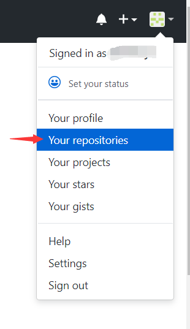
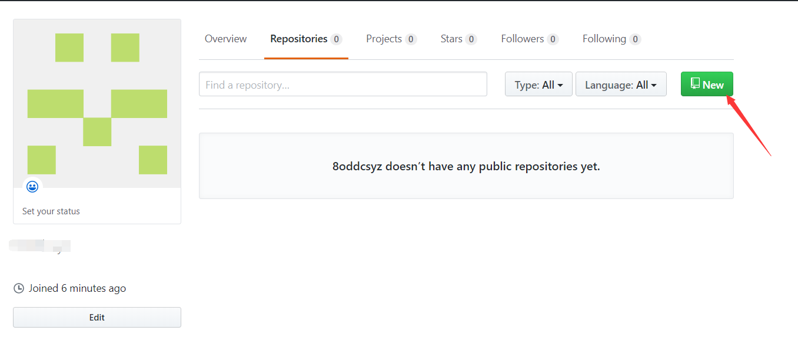
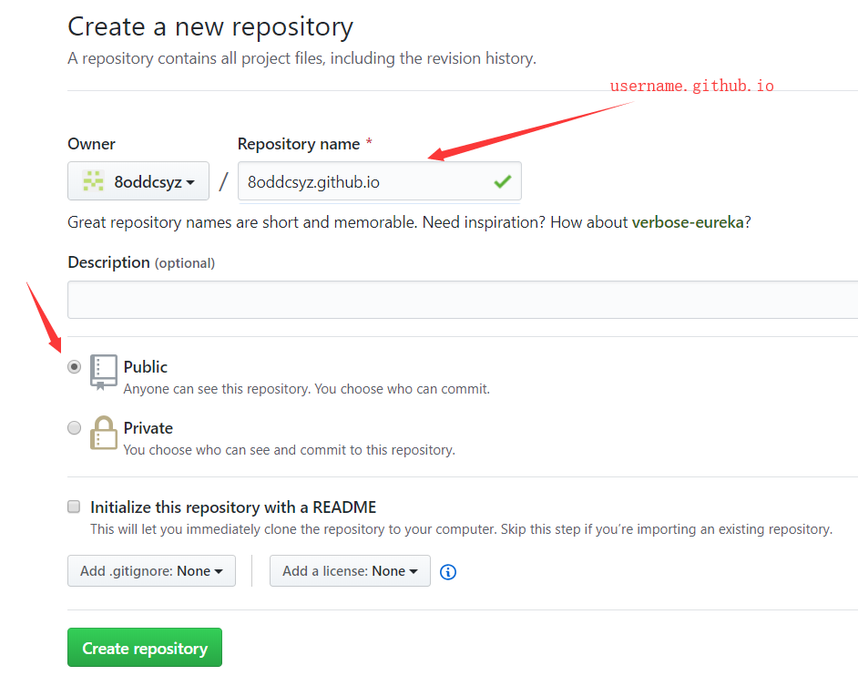
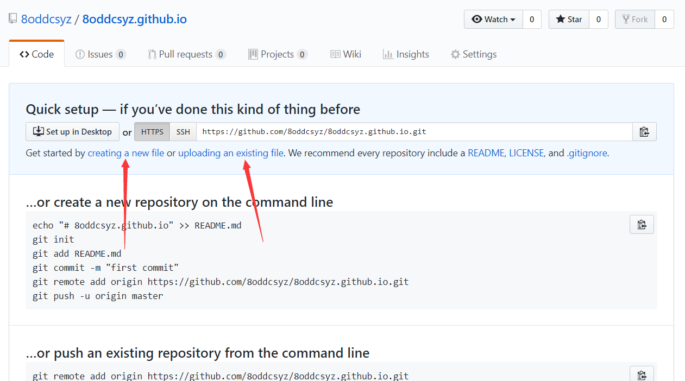
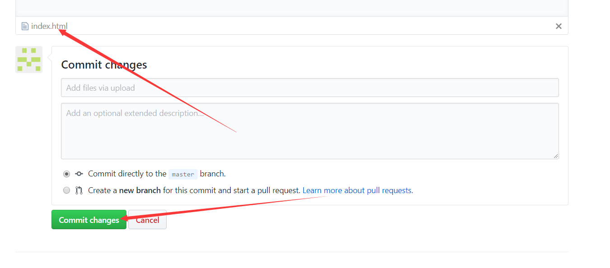

# Start

### 当然是不可能从注册开始的啦,自己去GitHub注册一个帐号。

### 1. 注册完毕来到GitHub首页，进入仓库

### 2.新建仓库

> 而这个repo的特殊之处就是，它的名字必须是“username.github.io”（划重点啦，不要打瞌睡！），其中，username就是你的GitHub账户的用户名

### 3.文件上传

### 4.结束

上传完毕后，等几分钟再访问你的username.github.io就可以看到效果。

