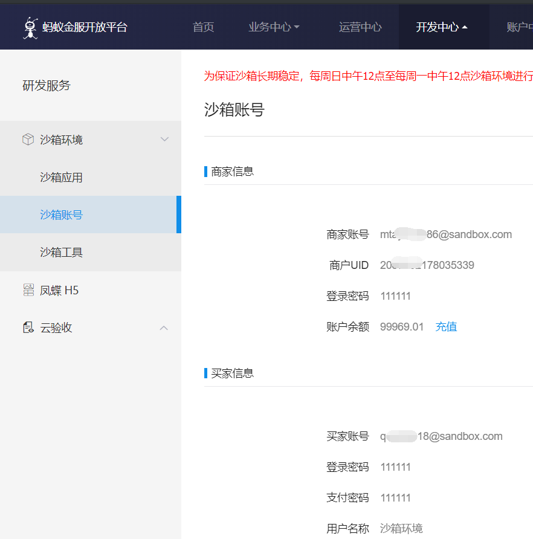

# 接入阿里支付

### 1、下载官方Demo

[地址下载](https://docs.open.alipay.com/270/106291/)

### 2、导入Demo到IDE

这里我推荐自己在IDE新建一个JAVA Web项目，然后复制官方Demo的核心文件到项目里面。

### 3、配置

1.注册阿里金服开发者帐号

* [注册链接](https://open.alipay.com)
* 注册完成后，点击开发中心研发服务-&gt;研发服务-&gt;沙箱环境

2.配置信息

* 设置app\_id和gatewayUrl

  网关有dev字样，表明是用于开发测试。

* 设置密钥
  1. [下载工具](https://docs.open.alipay.com/291/105971)
  2. 打开工具生成密钥

     `选择2048位生成密钥，并打开密钥文件路径`

  3. 点击信息部分的设置公钥

     `复制密钥文件路径内的"应用公钥2048.txt"中的内容到点击"设置应用公钥"的弹出框中并，保存`

  4. 复制密钥文件路径内的"应用私钥2048.txt"中的内容到merchant\_private\_key
  5. 刷新页面点击查看公钥，复制公钥内容到\(alipay\_public\_key\)
* 修改URL

  `修改服务器异步通知页面路径（notify_url）和 页面跳转同步通知页面的路径（return_url）`

3.运行测试

`测试用的支付宝买家账户可以在"沙箱账"这个页面可以找到，分为商家帐号和买家帐号`

